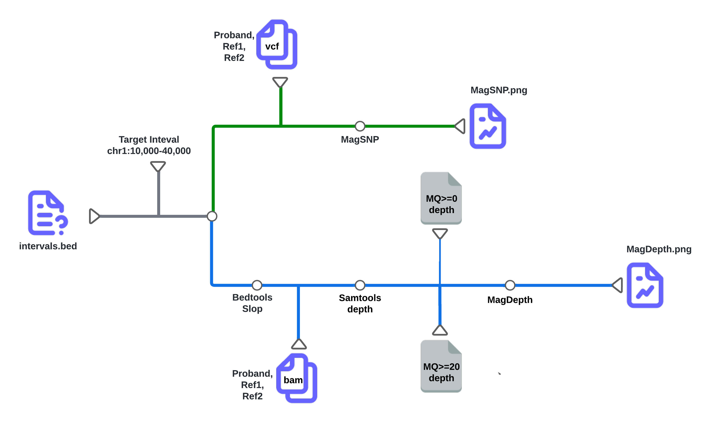
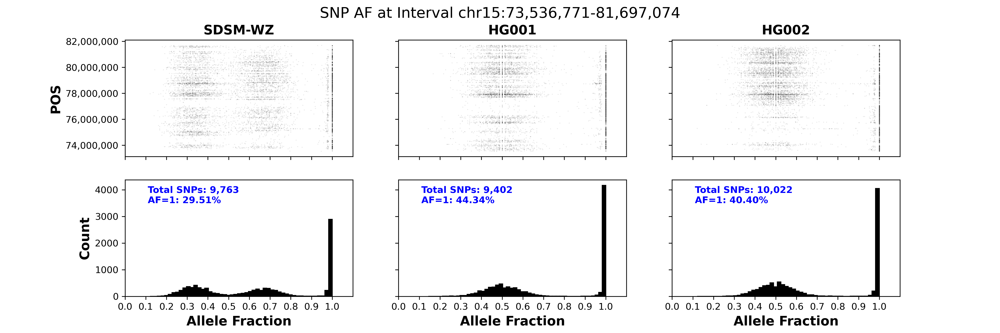
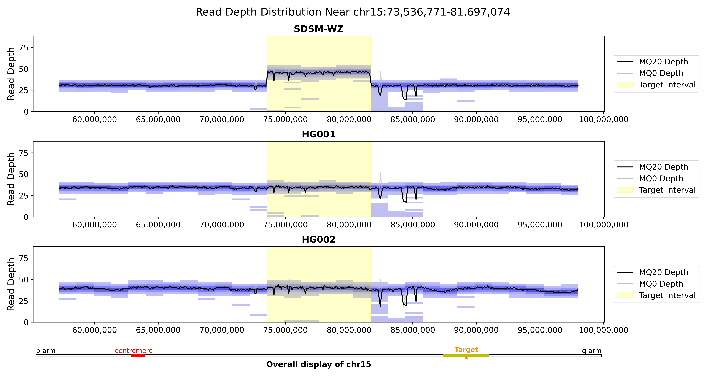

# CNV-Mag
A tool to visualize CNV Events in WGS Data. CNV-Mag is taking use of BAM and short variant VCF files to visualize CNV events in WGS data in simple and direct way. It can help you to verify if a CNV event is real or not.
This tool is part of the Broad Clinical Labs’s CNV reporting workflow.

## Background
Verifying whether a CNV event is real or not is a challenging task. A common approach involves loading aligned BAM files and VCFs into IGV to inspect read depth, soft clips, and SNP Allele Fraction (AF). However, visualizing read depth in IGV can be difficult, especially when breakpoints are not precisely defined. While checking SNP AF is a valuable method for confirming CNV events, it becomes impractical for multi-megabase events, as only a few SNPs can be examined. Relying on a limited number of SNP pileups often misses critical AF patterns, leading to incomplete evidence. The challenge intensifies when the CNV event occurs in a repetitive region. CNV-Mag is designed to address these issues by providing a simple and direct way to visualize CNV events. It displays both read depth and SNP AF for the CNV region in a single, comprehensive figure, enhancing the clarity and accuracy of your analysis.
The soft-clip information is not included in the current version of CNV-Mag. I am working on it and will
release it in the future.

## Workflow
CNV-Mag is a simple and direct tool to visualize CNV events in WGS data. It is taking use of BAM and short variant VCF files to visualize CNV events in WGS data. The workflow is shown below:
Input:
- BAM file and BAM index file
  - Aligned BAM file of your sample
  - HG001 BAM file preferred using the same pipeline as above
  - HG002 BAM file preferred using the same pipeline as above
- Short variant VCF file
    - Short variant VCF file of your sample
    - HG001 VCF file preferred using the same pipeline as above
    - HG002 VCF file preferred using the same pipeline as above
- CNV region (Bed or a list of Strings)
  - Can be a single CNV region or multiple CNV regions
- Reference genome (hg19 or hg38)

There are two main workflows in CNV-Mag:
- Mag-SNP
  - Visualize all the PASS SNP AF of the CNV region.

- Mag-Depth
  - Visualize the read depth of the CNV region.

## Running CNV-Mag on Terra
You can run CNV-Mag on Terra. The workflow is available at https://dockstore.org/workflows/github.com/broadinstitute/CNV-Mag/CNV-Mag:dev?tab=info.
You can deploy the workflow to your workspace and run it on Terra.

## Runtime specification
CNV-Mag is part of Broad Clinical Lab CNV reporting workflow. The run cost is less than $2 per run. 
