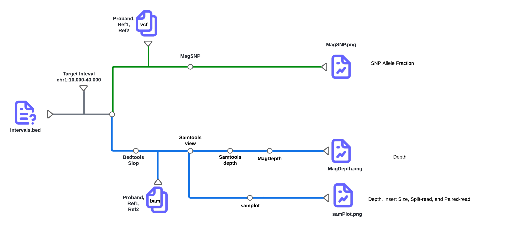
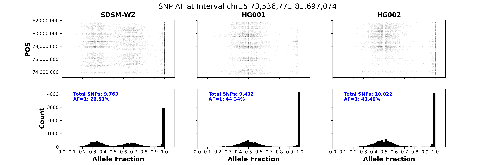
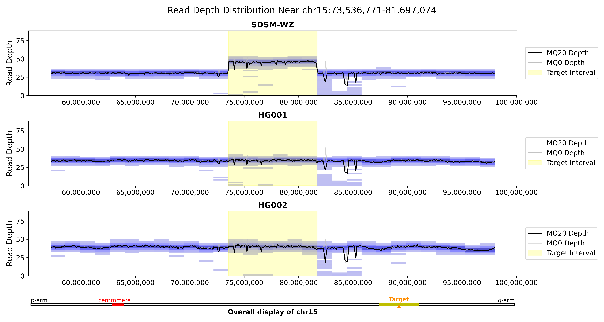
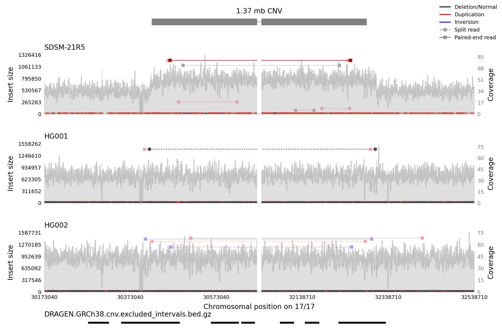

# CNV-Mag
A tool to visualize CNV Events in WGS Data. CNV-Mag is taking use of BAM and short variant VCF files to visualize CNV events in WGS data in simple and direct way. It can help you to verify if a CNV event is real or not.
This tool is part of the Broad Clinical Labs’s CNV reporting workflow.

## Background
Verifying CNV events can be challenging, especially for multi-megabase events. A common approach involves using IGV to inspect read depth,
soft clips, and SNP Allele Fraction (AF). However, this becomes impractical for large events. CNV-Mag addresses these challenges by 
providing a streamlined tool for visualizing CNV events. It also integrates [Samplot](https://github.com/ryanlayer/samplot), 
an excellent package for structural variant visualization, as part of its workflow.

## Workflow
CNV-Mag takes BAM and short variant VCF files to visualize CNV events in WGS data. The workflow is shown below:
Input:
- BAM file and BAM index file
  - Aligned BAM file of your sample
  - HG001 BAM file preferred using the same pipeline as above
  - HG002 BAM file preferred using the same pipeline as above
- Short variant VCF file (Requires AF field in the INFO column)
    - Short variant VCF file of your sample
    - HG001 VCF file preferred using the same pipeline as above
    - HG002 VCF file preferred using the same pipeline as above
- CNV region (Bed or a list of Strings)
  - Can be a single CNV region or multiple CNV regions
- Reference genome (hg19 or hg38)

There are three main workflows in CNV-Mag:
- Mag-SNP
  - Visualize all the PASS SNP AF of the CNV region.

- Mag-Depth
  - Visualize the read depth of the CNV region.

- Samplot
  - Visualize the discordant reads and split-read signals of the CNV region.

## Running CNV-Mag on Terra
You can run CNV-Mag on Terra. The workflow is available at https://dockstore.org/workflows/github.com/broadinstitute/CNV-Mag/CNV-Mag:dev?tab=info.
You can deploy the workflow to your workspace and run it on Terra.

## Runtime specification
CNV-Mag is part of Broad Clinical Lab CNV reporting workflow. The run cost is less than $2 per run. 
